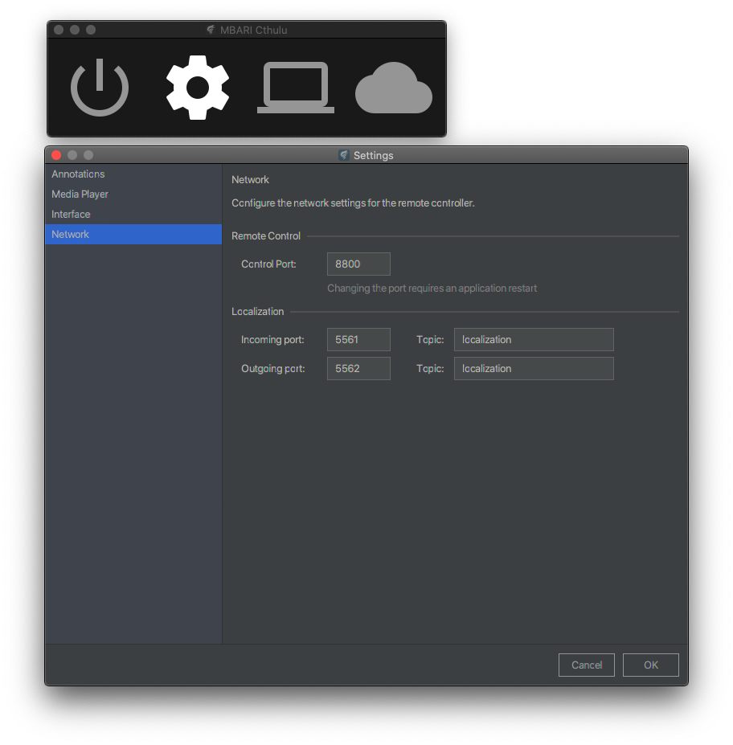
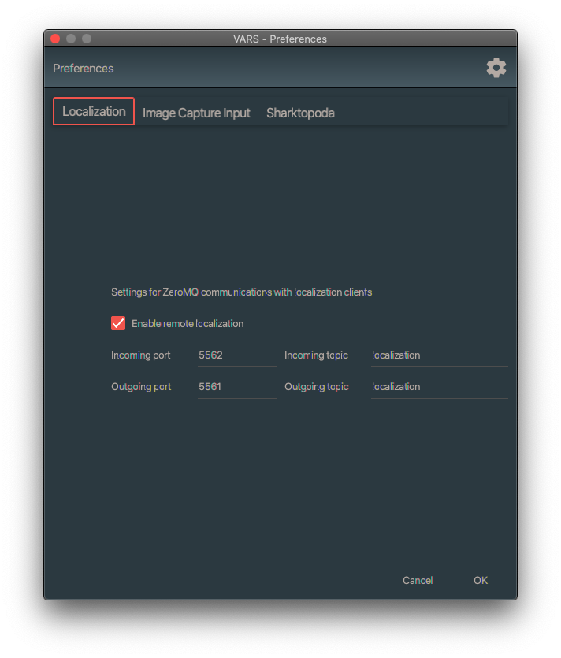

# Using VARS with Cthulhu

## tl;dr

Cthulhu is one of serveral video players that can interact with VARS, but it is the only one that currently supports localization. Basically, localization is the ability to draw a bounding box on the video that defines the region of interest of the annotation. You can view this in action on [YouTube](https://youtu.be/FKeuG8-UYC0). In order for VARS to work with Cthulhu, a few preferences in VARS and Cthulhu have to be set.

## Installation

1. Install [VLC](https://www.videolan.org/vlc)
2. Install [Cthulhu](https://github.com/mbari-media-management/cthulhu/releases)

## Configuration

### Configuring Cthulhu

To configure Cthulhu, do the following:

1. Launch Cthulhu
2. Open its settings (i.e. click on the gear icon).
3. In the setting window, click on `Network`
4. Under the `Remote Contol` section, set the `Contorl Port` value. This should match whatever you use to configure VARS to talk to [Sharktopoda](https://github.com/mbari-media-management/Sharktopoda). The customary value at MBARI's video lab is `8800`
5. Under the `Localization` section note the incoming ports and topics. There's no need to change them, but you'll need those values to configure VARS.

### Configuring VARS

1. Launch VARS Annotation
2. Open the settings (i.e. click on the gear icon on the toolbar)
3. Select the `Localization` tab
4. Select `Enable remote localization`
5. The VARS `incoming port` should have the same value as Cthulhu's `outgoing port`. e.g. Cthulhu outgoing  5562 maps to VARS incoming 5562. 
6. The VARS `outgoing port` should have the same value as Cthulhu's `incoming port`.
7. For simplicity, just leave all the topics as `localization`.

## Usage

With both VARS and Cthulhu running, open videos as you normally would in VARS. If you see any object of interest in the video, simply click on the video and drag a bounding box around it. This will create a new annotation in VARS with a bounding box definition.